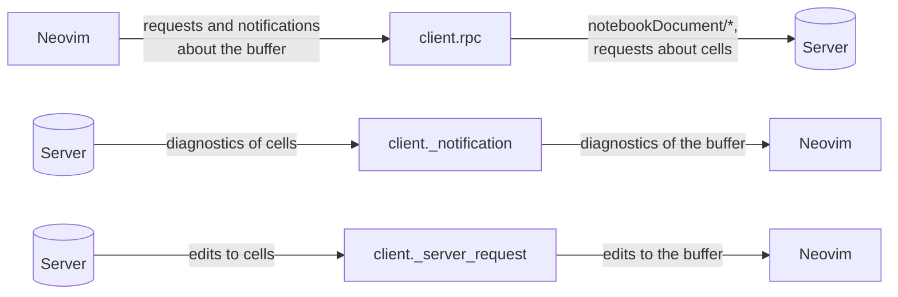
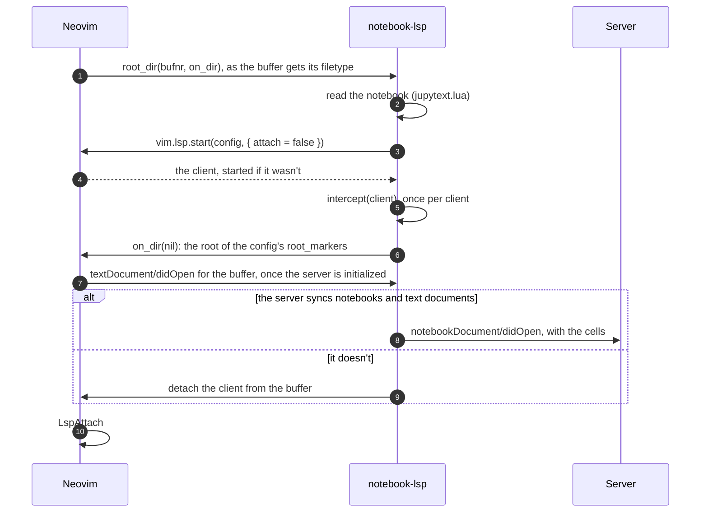
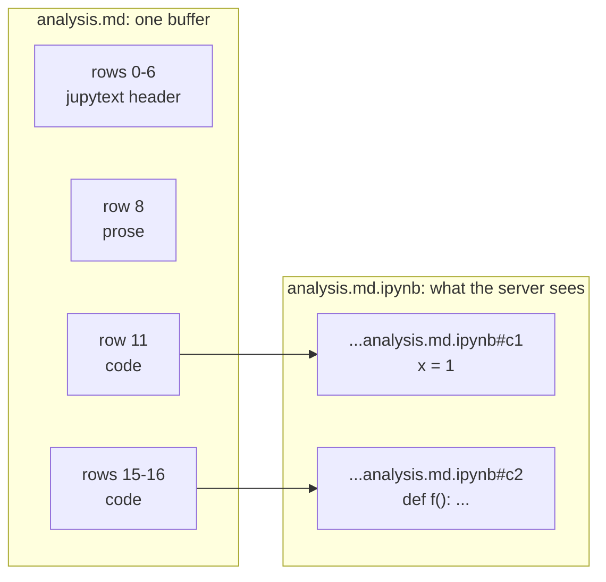
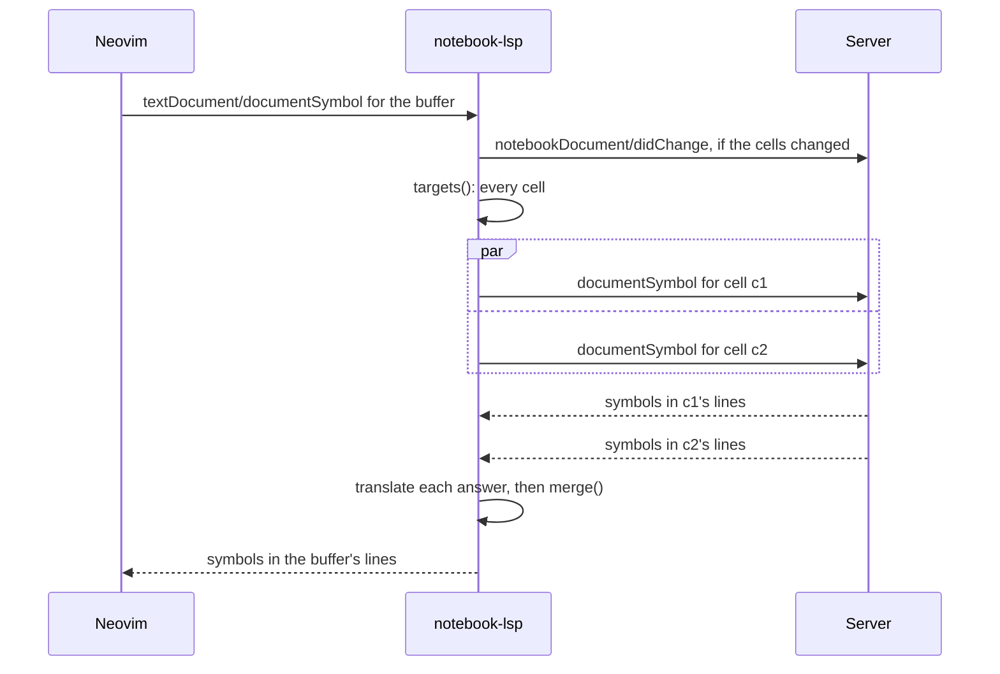
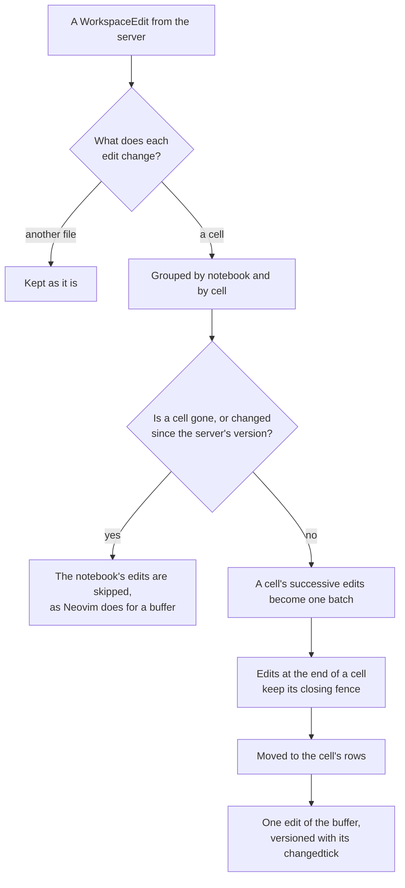

# Architecture

How notebook-lsp.nvim works, for someone about to read or change its code. To
set up, run the checks, or add an LSP method, see
[DEVELOPMENT.md](DEVELOPMENT.md).

## In short

You edit a jupytext notebook as one Markdown buffer. Language servers see it as
a notebook (`notebookDocument/*` in the LSP specification), whose cells are the
buffer's code cells.

The plugin adds no buffers and no clients. Neovim attaches the same client that
serves your `.py` files to the notebook buffer, and the plugin puts itself
between that client and its server. It turns what Neovim says about the buffer
into what a server expects of a notebook, and what the server says about the
cells back into the buffer's terms. Everything about other documents passes
through as it is.



The answers to Neovim's requests come back through `client.rpc`, translated
the same way.

## Code map

| File | What it owns |
|---|---|
| `plugin/notebook_lsp.lua` | The options (`vim.g.notebook_lsp`), and the servers the plugin extends when it loads |
| `lua/notebook_lsp/init.lua` | Attaching, keeping servers up to date, routing requests to cells, merging their answers, and the hooks on the client |
| `lua/notebook_lsp/translate.lua` | Turning the server's values into the buffer's terms: positions, URIs, edits, and the items the server gets back later |
| `lua/notebook_lsp/notebook.lua` | A notebook buffer: its code cells and their ids |
| `lua/notebook_lsp/jupytext.lua` | Which lines are code cells, and in which language, as jupytext decides |

`init.lua` is the largest file. One closure per client, `intercept()`, keeps
that client's state together: what the server knows of each notebook, and the
diagnostics it published. If the file grows much, routing (`targets()`) and
merging (`merge()`) are the parts to move out first. Keeping servers up to date
and the hooks share the per-client state, and should stay together.

## What must stay true

Besides the rules in [DEVELOPMENT.md](DEVELOPMENT.md#rules):

- **Other documents pass through.** The plugin sits on the clients `.py` files
  use, so it changes nothing about other documents: their requests, answers and
  messages pass as they are. Answers about them that name cells, such as a
  rename from a `.py` file, are the one exception.
- **A cell's lines are the buffer's lines.** A position in a cell is the same
  position in the buffer, a fixed number of lines lower. Moving a position
  never changes its column, so it doesn't depend on the position encoding.
  Only checking what edits leave in a cell does.
- **Only the plugin makes cell URIs.** A `vscode-notebook-cell:` URI that names
  no current cell is about a cell that's gone.
- **The server gets its opaque values back as it gave them:** `data` fields
  and a command's `arguments`.

## Attaching

`plugin/notebook_lsp.lua` calls `extend()` for each server it knows. `extend()`
adds four things to the server's `vim.lsp.config`:

- `filetypes`: `markdown`, besides the server's own.
- `root_dir`: lets only jupytext notebooks in the server's language through.
- `get_language_id`: a notebook's is its cells' language. Neovim matches the
  document selectors of a server's dynamic registrations against it.
- `capabilities`: `notebookDocument.synchronization`.

Neovim calls `root_dir` synchronously when a buffer gets its filetype, before
it attaches the client. That is the plugin's one chance to get between the
client and its server before Neovim sends anything about the notebook:



Neovim doesn't send `textDocument/didOpen` to a server that doesn't sync text
documents. The plugin detaches those servers at `LspAttach` instead.

`intercept()` replaces three things on the client:

- `client.rpc`, which all of Neovim's requests and notifications go through.
- `client._notification`, which Neovim looks up for each notification from the
  server.
- `client._server_request`, which Neovim looks up for each request from the
  server.

## Notebooks and cells

`notebook.lua` reads the buffer's code cells in the kernel's language, with the
jupytext reader. Each cell gets an id: an extmark on its opening fence. The id
stays with the cell as lines are added or removed around it, and goes when the
fence is deleted. A cell whose fence is deleted and typed again is a new cell.

The server knows the notebook as `<Markdown file>.ipynb`, and each cell as
`vscode-notebook-cell:<Markdown file>.ipynb#c<id>`. A cell's text is its lines,
each ending with a line break. Its last line break is the one before its
closing fence.

For this buffer:

```text
 0  ---
 1  jupyter:
 2    kernelspec:
 3      display_name: Python 3
 4      language: python
 5      name: python3
 6  ---
 7
 8  Some prose.
 9
10  ```python
11  x = 1
12  ```
13
14  ```python
15  def f():
16      return x
17  ```
```



Row 16, column 11 in the buffer (`x` in `return x`) is line 1, column 11 of
cell `#c2`.

## Keeping the server up to date

The plugin tells the server about the notebook when Neovim would tell it about
the buffer. It doesn't use the text in Neovim's messages: it reads the cells
from the buffer again, and compares them with what it last sent. For a cell
whose text changed, it sends the blocks of lines that differ
(`translate.line_edits()`), or the cell's whole text to a server that asks for
full changes.

| Neovim sends | The plugin sends instead |
|---|---|
| `textDocument/didOpen` | `notebookDocument/didOpen`, with every cell |
| `textDocument/didChange` | `notebookDocument/didChange`, with the cells that were added, removed or changed, if any |
| `textDocument/didClose` | `notebookDocument/didClose` |
| a write of the buffer (`BufWritePost`) | `notebookDocument/didSave`, if the server asks for it |

The plugin also sends the changes before each request about the notebook.
Neovim does that itself, except for requests about buffer 0.

## Requests

A request about the notebook buffer goes to the cells it concerns. `targets()`
decides which, from the request's parameters:

| The request has | It goes to |
|---|---|
| a position | the cell the position is in |
| positions | the cells the positions are in, each with its own |
| a range or ranges | the cells they overlap, each with the part in it |
| none of these | every cell |

Each cell's request names the cell's URI, with positions in the cell's lines.



The cells' requests go to the server in order, at most 16 at a time: the next
one goes when an earlier one is answered. A request about every cell would
otherwise send dozens at once, which a server may not handle. For example,
ty 0.0.84 stops answering if 41 requests arrive as it starts.

Neovim gets a request id of the plugin's own, which is negative, so it never
clashes with Neovim's. Cancelling it cancels the cells' requests the server
has, and drops those still waiting.

`merge()` combines the cells' answers. It concatenates lists, and has its own
cases for answers that aren't lists:

- **Selection ranges:** one per position, in the request's order.
- **Semantic tokens:** each cell's tokens, re-encoded relative to the token
  before them in the buffer. A token ends with its cell at the latest, as
  Neovim ends it in a buffer of its own, so a wrong length can't spread its
  highlight over the prose and the cells after it.
- **Pulled diagnostics:** one full report of every cell's diagnostics.

## Answers

`translate.to_client()` turns the server's values into the buffer's terms, by
their shape:

- **Positions** move down to the cell's rows. A position without a URI of its
  own is in the cell the request was about.
- **Cell URIs** become the buffer's URI.
- **Values about a cell that's gone** are left out, up to the list they're in.
  For example, a reference into a deleted cell is dropped from the list of
  references.
- **Answers that arrive after their cell moved** are mapped to where the cell
  is when they arrive.

### Edits

Edits to several cells of a notebook become one edit of the buffer, which
Neovim applies at once.



Two steps need to know the text that edits leave in a cell. A cell's successive
edits each apply to what the ones before left, so they become one batch. Edits
that reach the end of a cell must leave its closing fence on a line of its own.
For both, the plugin applies the edits with Neovim's own
`vim.lsp.util.apply_text_edits` to the cell's lines and a fence, in a scratch
buffer of its own. It gets the same result Neovim gets when it applies them to
the notebook buffer.

A `workspace/applyEdit` that changes a cell that's gone, or changed since, is
refused as a whole, with a reason, rather than applied in part.

### Items the server gets back

Some items in answers go back to the server later: an item to resolve, a call
or type hierarchy item, or the diagnostics in a code action request. The
server must get them back as it gave them, in their cell's lines.

- **Code actions, code lenses, inlay hints, document links, hierarchy items and
  diagnostics** record their cell and the server's original in their `data`,
  as `{ notebook_lsp = <cell URI>, item = <original> }`. The server gets the
  original back.
- **Completion items** record their cell, and the row it started at, in a field
  of their own (`notebook_lsp`), apart from their `data`. Completion engines
  fill in items with the list's defaults, each in its own way. To resolve an
  item, the plugin sends it as the engine made it, moved back to the cell's
  lines.

A record counts only if it names a cell URI, since a server's own data may use
the same key.

## Diagnostics

- **Pushed diagnostics** (`textDocument/publishDiagnostics`) come for one cell
  at a time. The plugin keeps each cell's, in the cell's lines, and shows all
  of them on the buffer, where the cells are now. It shows them again whenever
  the buffer changes, since cells move.
- **Pulled diagnostics** (`textDocument/diagnostic`) go to every cell, as one
  request each, and come back as one full report. The plugin never asks for
  changes since an earlier report: the cells' reports can't be compared with
  the buffer's.
- **A server that does both,** like ruff, has its pushed diagnostics for cells
  ignored, which would show each diagnostic twice.

## How it follows the LSP specification

The plugin implements the client's side of notebook document synchronization,
from LSP 3.17.

### What it tells the server

| Part of the specification | What the plugin does |
|---|---|
| Client capability `notebookDocument.synchronization` | Sets it, with `dynamicRegistration = false` and `executionSummarySupport = false` |
| Server capability `notebookDocumentSync` | Syncs a notebook if one of its notebook selectors matches. A selector's `notebook` can be a notebook type or a filter, with `notebookType`, `scheme` and `pattern` (also a relative pattern). Its `cells`, if it has any, must include the kernel's language. |
| `notebookDocument/didOpen` | The notebook type is `jupyter-notebook`. Every cell is a code cell (`NotebookCellKind.Code`). Each cell document has the notebook's language (`languageId`), version 1, and its text. |
| `notebookDocument/didChange` | Sent only when something changed, with the notebook's version one higher. Cells added or removed are one change to the cell array, with the documents to open and close. A cell whose text changed gets a version one higher, and the lines that changed: whole lines replaced, last first, for a server that asks for incremental changes, or else its whole new text. |
| `notebookDocument/didSave` | Sent when the buffer is written, if `notebookDocumentSync.save` asks for it |
| `notebookDocument/didClose` | Closes the notebook and every cell document |
| Requests about the notebook | Each names a cell document. Positions are in the cell's lines, with the encoding the client and server agreed on. |
| `$/cancelRequest` | Cancelling a request about the notebook cancels each cell's request the server has |

### What it accepts from the server

| Part of the specification | What the plugin does |
|---|---|
| Answers to requests | Translated for the buffer. Several cells' answers are combined into one. |
| `data` fields and command arguments | Sent back to the server as it gave them |
| `textDocument/publishDiagnostics` | Shown on the notebook buffer, where each cell is now |
| `workspace/applyEdit` | Applied to the buffer. Refused, with `applied = false` and a `failureReason`, if a cell it changes is gone or changed since. |
| `window/showDocument` | Shows the notebook buffer, at the cell's position. Answers `success = false` for a cell that's gone. |

### Where it differs

- **Only code cells in the kernel's language** are sent, also to servers whose
  selector asks for other cells
  ([#2](https://github.com/datwaft/notebook-lsp.nvim/issues/2)).
- **The specification doesn't define cell URIs.** The plugin uses the scheme
  VS Code uses, `vscode-notebook-cell:`.
- **`textDocument/willSaveWaitUntil`** for a notebook buffer is answered with no
  edits, without asking the server: the specification has no notebook
  equivalent. Neovim's other messages about the Markdown file, such as
  `textDocument/willSave`, aren't sent.
- **Servers that sync notebooks but not text documents** don't attach to
  notebooks ([#5](https://github.com/datwaft/notebook-lsp.nvim/issues/5)).
- **Related reports about cells** in pulled diagnostics are ignored
  ([#6](https://github.com/datwaft/notebook-lsp.nvim/issues/6)).

## The Neovim it relies on

Tested with `NVIM v0.13.0-dev-1804+gfb1f321b0e`. The plugin relies on parts of
Neovim's LSP client that aren't public, and on how it behaves. When nightly
breaks the plugin, look at these first:

- Neovim sends every request and notification of a client through
  `client.rpc.request` and `client.rpc.notify`, with a `notify_reply` callback
  for requests.
- The RPC dispatchers look `client._notification` and `client._server_request`
  up on the client for each message.
- `root_dir` is called synchronously when a buffer gets its filetype, and
  `textDocument/didOpen` is sent as the client attaches, before `LspAttach`.
- `get_language_id` is what the document selectors of dynamic registrations
  are matched against.
- `Client:request` sends pending changes before a request, except when called
  for buffer 0 (the plugin sends them itself).
- `apply_workspace_edit` checks only the first document change's version, and
  only when it's above 0. The plugin versions a notebook's edits with the
  buffer's changedtick.
- `apply_text_edits`: how Neovim applies edits, which the plugin relies on to
  see what they leave.

The specs also use `client.requests`, `vim.lsp.completion._lsp_to_complete_items`
and `vim.lsp.get_clients({ _uninitialized = true })`.
